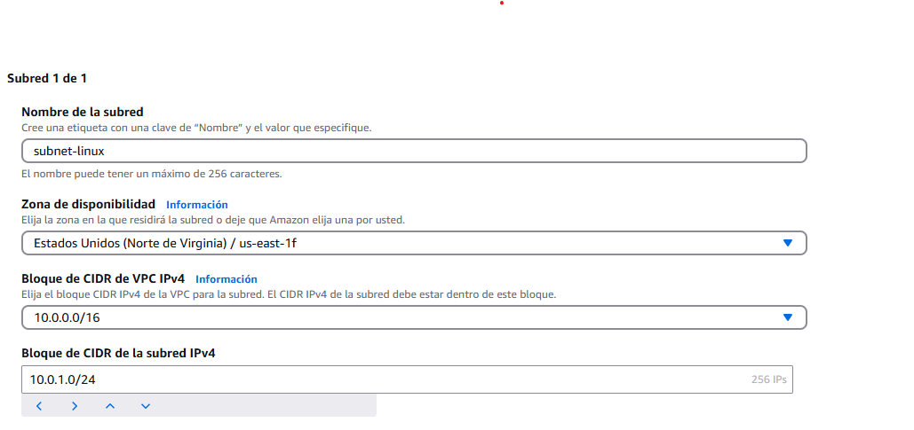

<!--  Examen AWS: Creación de una VPC con Máquinas Virtuales y Despliegue Web-->

<!--Documenta:
Configuración VPC y subredes.
Configuración instancias EC2.
Instalación Node.js, Vite y Serve.
Configuración Security Groups.
Capturas mostrando accesibilidad web.
Archivo README.md con capturas web.
Realiza un PR al repositorio de un compañero con revisión constructiva. -->

<!--Paso 1: Crear una VPC en AWS -->

 
 

<!--  Crea dos subredes:
subnet-linux: CIDR 10.0.1.0/24
subnet-windows: CIDR 10.0.2.0/24  -->

 
 

 <!--Crea una Internet Gateway asociada a la VPC. -->

 
  

 <!--Añade una regla en la tabla de rutas (0.0.0.0/0) hacia el Internet Gateway. -->
 

<!--Creación de instancias EC2 -->

<!--1. Instancia EC2 Windows
Windows Server 2022 en la subnet-windows.
Tipo: t3.medium.
Security Group Entrante: HTTP (80), Vite (5173), RDP (3389).-->
;[Foto8](../imagenes/Foto8.png); [Foto9](../imagenes/Foto9.png);
[Foto10](../imagenes/Foto10.png); [Foto11](../imagenes/Foto11.png); [Foto12](../imagenes/Foto12.png)
[Foto13](../imagenes/Foto13.png); [Foto14](../imagenes/Foto14.png); [Foto15](../imagenes/Foto15.png);

<!--2. Instancia EC2 Linux (Ubuntu)
Ubuntu 22.04 en la subnet-linux.
IP pública asignada.
Security Group Entrante: HTTP (80), Vite (5173), SSH (22).
Acceso mediante clave privada SSH -->
[Foto16](../imagenes/Foto16.png);[Foto17](../imagenes/Foto17.png);[Foto18](../imagenes/Foto18.png);
[Foto19](../imagenes/Foto19.png);[Foto20](../imagenes/Foto20.png);[Foto21](../imagenes/Foto21.png);
[Foto22](../imagenes/Foto22.png);

<!--Instalación y despliegue web
Nota:
Usaremos serve, un servidor web ligero para archivos estáticos generados por Vite.
La carpeta generada por Vite (dist) puede permanecer en tu directorio persona -->
[Foto23](../imagenes/Foto23.png); # Instala Node.js (motor JavaScript)
[Foto24](../imagenes/Foto24.png);[Foto25](../imagenes/Foto25.png); # Instala Vite y Serve
[Foto26](../imagenes/Foto26.png);[Foto27](../imagenes/Foto27.png); # Proyecto con Vite

[Foto28](../imagenes/Foto28.png); # Build optimizada  # Ejecuta servidor estático con Serve

<!--Security Groups AWS

Reglas entrantes (INBOUND):
HTTP (80) desde 0.0.0.0/0.
Vite (5173) desde 0.0.0.0/0.
SSH (22) desde tu IP pública (solo Linux).
RDP (3389) desde tu IP pública (solo Windows). -->
[Foto29](../imagenes/Foto29.png); [Foto32](../imagenes/Foto32.png);

<!--Reglas salientes (OUTBOUND):
Todo el tráfico permitido (0.0.0.0/0).
 -->
[Foto30](../imagenes/Foto30.png); [Foto31](../imagenes/Foto31.png);

<!--Probar el acceso web:
Acceso por navegador: http://tu_ip_publica:5173
Capturas en README de tu web y la de un compañero -->
 [Foto33](../imagenes/Foto33.png);  Verificamos el servidor web;
 [Foto34](../imagenes/Foto34.png); [Foto35](../imagenes/Foto35.png); Pagina web a traves de el servidor vite; [Foto42](../imagenes/Foto42.png); [Foto43](../imagenes/Foto43.png);
 

<!--Realizar un Pull Request al repositorio del compañero con revision constructiva -->
 [Foto36](../imagenes/Foto36.png); [Foto37](../imagenes/Foto37.png); [Foto38](../imagenes/Foto38.png);
 [Foto39](../imagenes/Foto39.png); [Foto40](../imagenes/Foto40.png);[Foto41](../imagenes/Foto41.png);

